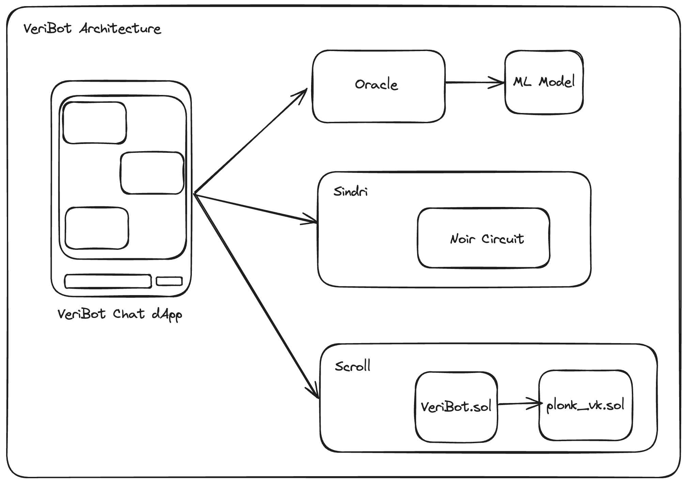

# VeriBot


## TL;DR: 


- VeriZK uses Zero-Knowledge Proofs and Machine Learning to certify smart contract security in the DeFi ecosystem without exposing source code, targeting developers who prioritize both privacy and integrity.
- Our **Goal** is to : use zkML to prove the absence of vulnerabilities in (closed-) source code. VeriZK leverages zkML (Zero-Knowledge Machine Learning) to prove the absence of vulnerabilities in (closed-) source code, particularly focusing on smart contracts within the decentralized finance (DeFi) ecosystem.

## Storytelling : User Experience 


// ADD EXPLANATION OF THE CHATBOT 


Imagine you've poured countless hours into crafting the perfect smart contract, only to face the daunting task of proving its safety without revealing your confidential source code.

Enter VeriZK! With VeriZK, developers can now confidently showcase the integrity of their contracts without compromising their code's confidentiality. Through Zero-Knowledge Proofs and Machine Learning, VeriZK empowers you to demonstrate your contract's reliability while keeping your code private. Say goodbye to sleepless nights worrying about rug pulls or vulnerabilities – VeriZK has got your back, ensuring your creations are as trustworthy as they are confidential.

## Architecture 




- **Circuit** : Utilizes Zero-Knowledge Proofs in [Noir Language](https://noir-lang.org/docs/getting_started/installation/) to validate machine learning inferences on smart contract bytecode, ensuring privacy and integrity without revealing the bytecode.
- **Oracle** : A Rust-built intermediary that securely connects off-chain machine learning predictions with on-chain smart contract decisions, enhancing contracts without exposing underlying data or models.
- **Machine Learning**: Analyzes smart contract bytecode to infer properties or vulnerabilities, acting as a privacy-preserving tool that abstracts complex contract logic for secure validation.

## How it's Made

We are generating off-chain proofs using Sindri. 


# Technologies Used


## OPENAI 


## AZTEC 

Noir Language is used to .. 

#### Feedback 


## SINDRI 

We are generating off-chain proofs using Sindri. 

#### Feedback 
Limitations : Sindri cannot call Oracles. We found a way to send the proof to our circuit and tell the bot to verify the proof. 


### SCROLL 

We have created a contract through NOIR by running nargo prove and this contract was deployed to Scroll. 


#### Feedback using Foundry 
- Custom verification of smart contracts using Foundry : after deploying contracts, verification process is as follow :
```
forge verify-contract \
    --num-of-optimizations 10 \
    --watch \
    --constructor-args  $(cast abi-encode "constructor(address)" 0x14299C00861767244D552B206dd9217EafA0196b) \
    --verifier etherscan \
    --verifier-url https://api-sepolia.scrollscan.dev/api \
    --etherscan-api-key V4P48P91YBYEK963CWQKM9G3YTTJRKJA8Y \
    --compiler-version v0.8.20+commit.a1b79de6 \
    0x703936A24DFaDcD34008Db338FDB087c43C8c56a \
    ZKProof 
    
``` 
#### Feedback 


### AVAIL 

#### Feedback 


# Instructions:

1. Add 
```
NEXT_PUBLIC_OPENAI_API_KEY=sk-...
```

to frontend/packages/nextjs/.env.local

2. 

```
cd frontend
yarn install
yarn chain
yarn deploy
yarn start
```

# Happy Path Conversation:
```
- user: i want to verify that a contract is not vulnerable but i don't have the source code
- bot: that's fine, send me the bytecode
- user: here's the bytecode
- system: call oracle function with bytecode and receives JSON object response
- system: call sindri function with oracle JSON output and receive zk Proof
- bot: here is the zk proof that it's safe
- user: cool, i'd like to verify this
- system: call blockchain function with zkProof to contract on Scroll and receive true or false
- bot: yes it's verified that the proof is correct that there's no vulnerability in the code
```

